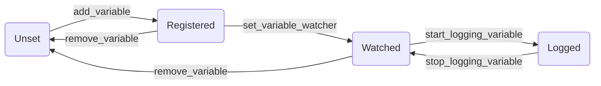
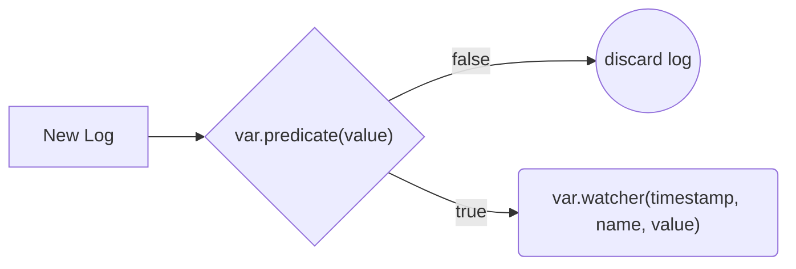
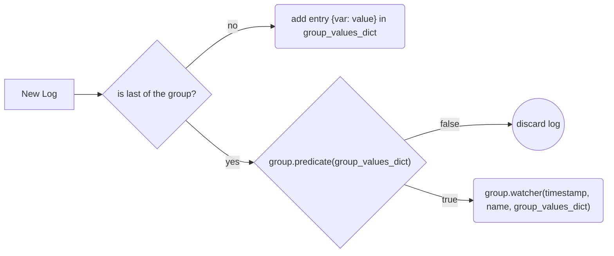

# cflibExtension

cflibExtension is an extension package for the official [cflib](https://github.com/bitcraze/crazyflie-lib-python) library from Bitcraze. It is built on top of the and its purpose is to provide a simpler API to program the Crazyflie 2.x quadcopters. In particular it implements and offer four main functionalities:

 - [Simplified Logging and Parameter framework](#logging--parameters).
 - [One API for each main expansion decks](#decks-api).
 - [Utility modules for the state of the Crazyflie](#utility-modules).
 - [Coordination framework](#coordination-framework).

All this functionalities are accessible from the main component of this extension: [*ExtendedCrazyFlie*](extended_crazyflie.py) allowing the users to interact with all the functions offered from a single and standard point.
## Logging & Parameters
The Logging & Parameters framework of the cflibExtension is a simplified and optimized version of the standard framework that the original cflib offers for reading/writing values from/to the crazyflie. In particular:
**Logging** is defined as *"a **periodic** reading of a variable from the crazyflie with a period in the range from 10ms to 2550ms"*
**Parameters** is defined as *"a **single operation** of read or write of a variable from/to the crazyflie"*
Important to notice is that the set of parameters and the set of logging variables are completely disjointed and each of them is defined inside its Table of Content (ToC):

 - [Logging variables ToC](https://www.bitcraze.io/documentation/repository/crazyflie-firmware/master/api/logs/)
 - [Parameters variables ToC](https://www.bitcraze.io/documentation/repository/crazyflie-firmware/master/api/params/)

Both the two tables are organized in ***groups*** that aggregates variables according to their meaning.

The extension manages all the low level configurations and functionalities using two dual managers:

 - [LoggingManager](#logging-manager)
 - [ParametersManager](#parameters-manager)
### Logging Manager
> Implemented by the class [LoggingManager](variables/logging_manager.py)

It allows to perform the following operations:
| LogVariable management methods |descriptions| 
|--|--|
| `add_variable(group, name, period_in_ms, type?)` | It register a variable inside the logging framework specifying the period of logging desired an optionally the type (LogVariableType) used for logging, if not provided the default type for the variable selected is used. | 
| `add_group(group, period_in_ms, type?)` | It register all the variable belonging to the provided group using the same period and, if specified, the same type. |
|`remove_variable(group, name)`|Delete the variable from the manager, use this to free up unused resources.|
|`remove_group(group, name)`|Delete all the variable registered in the manager that belongs to the provided group.
---
| LogVariable logging methods |descriptions|
|--|--|
|`start_logging_variable(group,name)`| the variable is marked as running so each log that comes from the cf for this variable is used in the callbacks method. |
|`stop_logging_variable(group,name)`| stops logging for the variable|
|`start_logging_group(group)`| each variable registered and belonging to the group is started. |
|`start_logging_group(group)`| each variable registered and belonging to the group is stopped.|
|`start_logging_all()`| each variable registered is started. |
|`start_logging_all()`| each variable registered is stopped.|
---
| LogVariable callbacks methods |descriptions| examples|
|--|--|--|
| `set_variable_predicate(group, name, predicate)` | It sets a filter in the logging: the *predicate* arg is a function that takes as input the value of the logged variable and returns a boolean indicating if that value shuould be logged or not | `set_variable_predicate('range', 'top', lambda t: t >= 1000)` it filter out all the logs where the variable 'range.top' is less than 1000.|
| `set_group_predicate(group, predicate)` | It sets a filter in the logging of the group: the *predicate* arg is a function that takes a dict of the log of the group and returns a boolean indicating if that values shuould be logged or not |`set_group_predicate('range', lambda d: d.top >= 1000 and d.left <= 1000)` it filter out all the group logs where the variable 'range.top' is less than 1000 and at the same time the 'range.left' is greather than 1000.|
|`set_variable_whatcher(group, name, cb)`|Set a callback function that is called whenever a new logs relative to the specified variable arrives from the cf(if any predicate is defined, the callback is called only if the predicate function returns true). This function needs to take 3 args that are respectively timestamp - variable name - variable value.| `set_variable_whatcher('range', 'top', lambda ts, name, val: do_someting(ts,name,val))` whenever the crazyflie logs this variable this watcher is called, hence the function do_something() will perform some action using this value, e.g. printing the values on the console.|
|`set_group_whatcher(group, cb)`|Set a callback function that is called when all the variable of the group has logged a value, the cb function is called whit 3 args: a timestamp - group's name - a dictionary with var:value entries for each variable registered for the group | `set_group_whatcher('range', lambda ts, name, dict: do_something(dict))` do_something is called when the last variable  registered and belonging to the 'range' group receive the logged value.|
---
Is important to notice that groups  predicate&watcher and variables predicate&watcher can be used at the same time having the maximum felxibility and expressive power.

##### Logging Variable lifecycle:

##### Variable logging flowchart:

##### Group logging flowchart:

### Parameters Manager
> Implemented by the class [ParametersManager](variables/parameters_manager.py)

It offers the same dual API as the Logging manager for the reading of a parameter variable with only two main difference:
 - Even if groups aggregation exist also for parameters, watcher and predicates can be specified only for single variables.
 - The predicate and the watchers are not applied periodically as it was for the logging but they are called only once the value has been modified in the crazyflie. They can be used to be have the guarantees that a value has been written and stored onboard the crazyflie.

The parameter framework offers also 2 other methods (the more relevant ones):
|Parameter methods| descriptions |
|--|--|
|`set_value(group,name,value)`| It set onboard the crazyflie the parameter variable specified with the provided value.|
|`get_value(group,name)`| It get the current value of the parameter variable specified directly from the crazyflie.|

## Deck's API
We decided to implement an API for the main expansion decks that can be mounted onboard the crazyflie with the purpose of providing a simple and quick way to use the functionalities they offer.
The decks we selected are:
 - [Flow Deck](#flow-deck-api)
 - [Multiranger Deck](#multiranger-deck-api)
 - [Z Ranger Deck](#z-ranger-deck-api)
 - [AI Deck](#ai-deck-api)
 - [Lighthouse Deck](#lighthouse-deck-api)
 - [LedRing Deck](#ledring-deck-api)

When connecting to the crazyflie using the ExtendedCrazyFlie class the extension will automatically discover which decks are mounted and instanciate each of them inside the dictionary `ecf.decks` with the key equal to the type of the deck ([DeckType](decks/deck.py)) and the value equal to the instance of the deck object. In this way the user does not care about initializing and setting up all the things and instead just use them.
### Flow Deck API
> Implemented by the class [FlowDeck](decks/flowdeck.py)

| properties | descriptions |
|--|--|
| ***zranger*** : *ZRanger* | Is a reference to the Z Ranger Object. Since the FlowDeck has a z-range sensor included, this is the object to use to interact with the z-range functionality offered by the deck. NOTE: is an instance of the [Z Range Deck API](#z-ranger-deck-api)  |
| ***ecf*** : *ExtendedCrazyFlie* | Is a reference to the ExtendedCrazyFlie that instanciated the object (the parent) |
| ***contribute_to_state_estimate*** : *bool*| Reference a parameter onboard the crazyflie: if *false* the flow sensor measurament does not contribute to the estimate of the state of the crazyflie, if *true* it contributes increasing the stability. It is initialized with the value of the parameter *motion.disable* |
| ***flow_x*** : *float* | is the estimated value of the x flow in pixel/frame |
| ***flow_y*** : *float* | is the estimated value of the y flow in pixel/frame |
| ***observable_name*** : *string* | is the name of the associated obsevable that contains the following state informations: `{flow_x : float, flow_y : float, zranger : {zrange: float}}`  (see [*Coordination Framework*](#coordination-framework))|

### Multiranger Deck API
> Implemented by the class [MultiRanger](decks/multiranger.py)

| properties | descriptions |
|--|--|
| ***ecf*** : *ExtendedCrazyFlie* | Is a reference to the ExtendedCrazyFlie that instanciated the object (the parent) |
| ***front*** : *int*| Is the measured value of the front sensor in mm |
| ***back*** : *int*| Is the measured value of the backsensor in mm |
| ***right*** : *int*| Is the measured value of the right sensor in mm |
| ***left*** : *int*| Is the measured value of the left sensor in mm |
| ***up*** : *int*| Is the measured value of the up sensor in mm |
| ***observable_name*** : *string*| Is the name of the associated obsevable that contains the following state informations: `{ front : int, back : int, right : int, left : int, up : int}`  (see [*Coordination Framework*](#coordination-framework))|

### Z Ranger Deck API
> Implemented by the class [ZRanger](decks/z_ranger.py)

| properties | descriptions |
|--|--|
| ***ecf*** : *ExtendedCrazyFlie* | Is a reference to the ExtendedCrazyFlie that instanciated the object (the parent) |
| ***contribute_to_state_estimate*** : *bool*| Reference a parameter onboard the crazyflie: if *false* the zrange sensor measurament does not contribute to the estimate of the state of the crazyflie, if *true* it contributes. It is initialized with the value of the parameter *motion.disableZrange* ( a custom parameter that allow to exclude zrange from state estimate) |
| ***z_range*** : *int*| Is the measured value of the zrange mm |
| ***observable_name*** : *string*| Is the name of the associated obsevable that contains the following state informations: `{zrange: float}`  (see [*Coordination Framework*](#coordination-framework))|
### AI Deck API
> **Notice:**
> To be able to use this class you need to be connected to the WiFi of the AI Deck which SSID should be 'Bitcraze Ai-deck Examples' (can be diffrent, see [official documentation](https://www.bitcraze.io/documentation/tutorials/getting-started-with-aideck/))

> Implemented by the class [AiDeck](decks/ai.py)

| properties | descriptions |
|--|--|
| ***port*** : *int* | Indicates the port where the AI Deck is listening for connection. *Default = 5000* |
| ***ip*** : *string*| Indicates the local ip address of the AI Deck inside its network to connect and receive the images. *Default = '192.168.4.1'*|
---
|methods| descriptions |
|--|--|
| `record(seconds?, path?, name, format?)` | this methods records a video in the format provided ('.mp4' or '.avi') in and save it in the path provided. By default it records 30 seconds of video but it can be changed using the `seconds` parameter. |
|`show_recording(filename?)`| It opens a window playing the video recorded. If the video is recorded before the call to this method the parameter `filename` can be omitted otherwise it is mandatory. |
| `run_ai(algo, *args)`| This function will start the video stream and calls the provided `algo` function passing the Image as first parameter as an array of bytes (in JPEG format). Additionaly this function takes optional parameter that are forwarded to the algo function (e.g., it can be useful to pass the MotionCommander instance)|
|`stop_ai()`| Just stops the stream of calls to the algo function.|
### Lighthouse Deck API
> Implemented by the class [Lighthouse](decks/lighthouse/lighthouse.py)

| properties | descriptions |
|--|--|
| ***ecf*** : *ExtendedCrazyFlie* | Is a reference to the ExtendedCrazyFlie that instanciated the object (the parent) |

| methods | descriptions |
|--|--|
| `simple_geometry_estimation()` | It estimate the geometry of the lighthouse with a single sample and then write it on the crazyflie. This is the weakest estimation process and should be used only for testing purposes. |
|`multi_bs_geometry_estimation()`| It is a guided process that will estimate the geometry with multiple samples and write it to the crazyflie. The user needs to move the drone manually during the process. It supports also more than 2 BaseStations. It is the most precise and reliable estimation process. |
|`automatic_geometry_estimation()`|It is an automatization of the previous process. It is still experimental and should be used carefully. The drone will move autonomously and will ask the support of the user only if needed. (see [Lighthouse configuration](decks/lighthouse/readme.md) for more details)|
|`upload_geometry(geo_dict)`|It uploads to the crazyflie the provided geometry. The geometry is passed inside the `geo_dict` parameter and must have the type `dict[int, LighthouseBsGeometry]`. |

### LedRing Deck API
>Implemented by the class [LedRing](decks/led.py)

| properties | description |
|--|--|
| ***ecf*** : *ExtendedCrazyFlie* | Is a reference to the ExtendedCrazyFlie that instanciated the object (the parent) |
|***effect*** : *Effect*| Is the effect that the mani ring will perform, a list of available effects is represented by the [Effect(Enum)](decks/led.py)|
|***headlight*** : *boolean*| if *true* the headlights of the deck are on, *false* otherwise. |
|***solid_effect_color*** : *Color*| Represent the color of the solid effect, the [Colors(Enum)](decks/led.py) gives a set of predefined colors but of course also custom colors can be used. |
|***fade_effect_color*** : *Color*| Represent the color of the fade effect, the [Colors(Enum)](decks/led.py) gives a set of predefined colors but of course also custom colors can be used. |
|***fade_effect_time*** : *float*| Represent the time of the fade effect. |
| ***observable_name*** : *string*| Is the name of the associated obsevable that contains the following state informations: `{effect: int, headlight:bool, solid_effect_color: Color, fade_effect_color: Color, fade_effect_time: float }`  (see [*Coordination Framework*](#coordination-framework))|

| methods | descriptions |
|--|--|
| `change_effect(efffect)` | Changes effect for the ring. |
|`toggle_headlight()`| Toggles the headlights. |
|`headlight_switch( on )`| Switch on the headlights if the parameter `on` is *true*, otherwise it switch them off . |
| `change_solid_effect_color(color)` | Changes the solid effect color. |
| `change_fade_effect_color(color)` | Changes the fade effect color. |
| `change_fade_effect_time(time)` | Changes the fade effect time. |
## Utility Modules
The extension provide 2 main utitlity modules:

 - [Battery Module](#battery-module)
 - [State Estimate Module](#state-estimate-module)

This modules has the purpose to make accessible and easyly usable the most important state variables.
### Battery Module
>Implemented by the class [Battery](battery.py)

This module provide the basics information on the power management status: 
| properties | descriptions |
|--|--|
| ***voltage*** : *float* | Represent the battery voltage in [V] |
| ***battery_level*** : *float* | Represent an estimate of the battery level in percentage |
| ***pm_state*** : *PowerManagementState* | Represent the status of the power management unit on the crazyflie (chaging, battery_low,...). A full list of the states is represented by the [PowerManagementState(Enum)](battery.py) |

### State Estimate Module
>Implemented by the class [StateEstimate](state_estimate.py)

This module provides the basics informations about the state of the crazyflie estimation: positon, velocity, acceleration and attitude. In addition it has some functionalities to track the positions during the flight and at the end plot them on a chart. By default it will provide the estimate only for the position, the other estimate can be added from the constructor.
| properties | descriptions |
|--|--|
| ***x*** : *float* | Represents the estimated position in the x coordinate [m]|
| ***y*** : *float* | Represents the estimated position in the y coordinate [m]|
| ***x*** : *float* | Represents the estimated position in the z coordinate [m]|
| ***vx*** : *float* | Represents the estimated velocity in the x direction [m/s]|
| ***vy*** : *float* | Represents the estimated velocity in the y direction [m/s]|
| ***vz*** : *float* | Represents the estimated velocity in the z direction [m/s]|
| ***ax*** : *float* | Represents the estimated acceleration in the x direction [g]|
| ***ay*** : *float* | Represents the estimated acceleration in the y direction [g]|
| ***az*** : *float* | Represents the estimated acceleration in the z direction without considering gravity [g]|
| ***roll*** : *float* | Represents the estimated roll angle [deg]|
| ***pitch*** : *float* | Represents the estimated pitch angle [deg]|
| ***yaw*** : *float* | Represents the estimated yaw angle [deg]|

| methods | descriptions |
|--|--|
| `record_positions(peroiod_in_ms, stop_after_s, append)` | Start the tracking of the positions. `period_in_ms` specifies the period of sampling, `stop_after_s` is the time in seconds to record for a limited amount of time, `append` is a bool: if *true* the new trackint is appended to the previous one|
| `record_velocities(peroiod_in_ms, stop_after_s, append)` | Start the tracking of the velocities.|
| `record_accelerations(peroiod_in_ms, stop_after_s, append)` | Start the tracking of the accelerations.|
| `record_attitudes(peroiod_in_ms, stop_after_s, append)` | Start the tracking of the attitudes.|
| `stop_record_positions()` | Stops the tracking of the positions.|
| `stop_record_velocities()` | Stops the tracking of the velocities.|
| `stop_record_accelerations()` | Stops the tracking of the accelerations.|
| `stop_record_attitudes()` | Stops the tracking of the attitudes.|
|`plot_positions_3D()`| Plot a chart of the trajectory tracked. |
|`plot_position_velocity_3D()`| Plot a chart of the trajectory tracked with a color of the line proportional to the velocity in that point. |
|`plot_position_acceleration_3D()`| Plot a chart of the trajectory tracked with a color of the line proportional to the acceleration in that point. |
|`plot_position_2D()`| Plot 3 charts (one for each axis) representing the variations of the position during time |
|`plot_velocity_2D()`| Plot 3 charts (one for each axis) representing the variations of the velocity during time |
|`plot_acceleraiton_2D()`| Plot 3 charts (one for each axis) representing the variations of the accelerations during time |
|`plot_attitude_2D()`| Plot 3 charts (one for each axis) representing the variations of the attitude during time |

## Coordination Framework